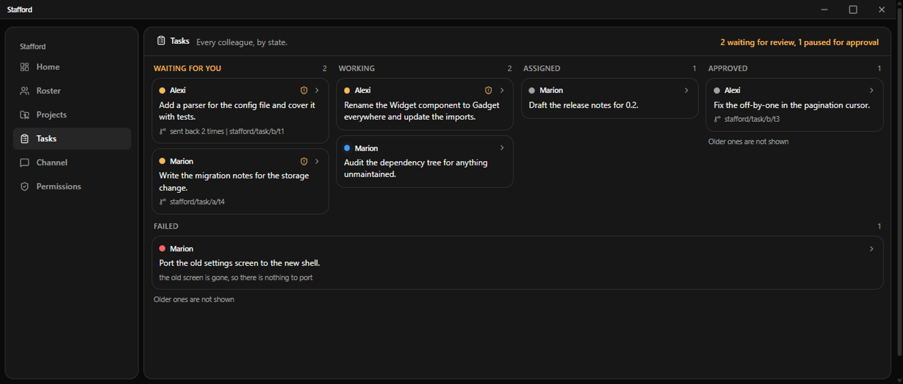
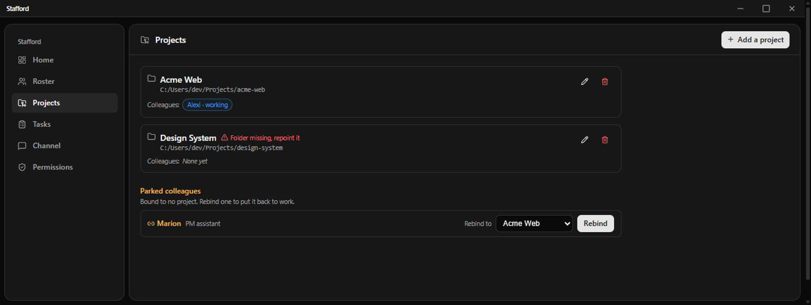

# Stafford

Stafford is a desktop app for running and supervising AI coding agents. You hire Claude Code
colleagues, give each one a project folder, message it or hand it a task, watch every action it takes
stream in live, and approve or deny what it does through a permission gate. It turns Claude Code from a
terminal you drive one prompt at a time into a small team you manage.

It is named after Stafford Beer, the cybernetician. The idea it borrows is variety management: keeping a
handful of autonomous workers legible and under control rather than tracking a list of tasks.

> Status: v0.2, early software. Windows only for now, and the build is unsigned, so Windows SmartScreen
> warns on first launch. It runs autonomous agents that can read and write files and run commands, held
> behind a permission gate where you are the approver. Read the Security model and Limitations sections
> before you point it at anything you care about.

## What it does

- You hire colleagues. Each one takes a role from a definition, gets a generated name, and runs its own
  headless Claude Code session that persists across restarts. A roster shows one card per colleague and
  what it is doing: working, idle, or waiting on you.
- You message a colleague and its reply streams in live. The thinking, the tool calls, shell output,
  file diffs, and a live to-do plan render inline as readable blocks, not as raw terminal text, and a
  finished turn re-renders the same way when you reopen it.
- A permission gate checks every file read, write, and edit a colleague makes against the project's
  rules and that colleague's own overrides. Anything set to ask pauses the turn until you approve or
  deny it in the app. Your credential directories (SSH, cloud, git, and the rest), Stafford's own data,
  and secret files like `.env`, private keys, and `credentials.json` are denied by default.
- You can hand a colleague a task instead of a message. It runs bounded by a turn limit and a
  no-progress stop, lands its work on its own git branch, and comes back to you for review rather than
  marking itself done. It reaches done only when you approve it. Sending it back resumes the same
  session with your note.
- A Projects tab manages projects in one place: create one, edit or repoint its working folder, delete
  it, and see which colleagues are bound to it. A colleague bound to no project is parked and cannot
  work until you rebind it, and a rebind starts a clean session on the new project rather than carrying
  the old project's context across.
- An OS notification fires when the number of things waiting on you goes up, so you do not have to keep
  the window open.
- Colleagues are contained. A project cannot point at Stafford's own directory, refused when you set it
  and again at spawn. Each session runs against a Stafford-managed config, so your personal Claude Code
  settings, memory, plugins, and your other repositories do not leak into a colleague's context.

## Requirements

- Windows 11.
- Claude Code, installed with its native installer and logged in. Stafford runs your local `claude`
  and uses your existing login; it does not ask for an API key.
- Node 22 or newer, only if you build from source (see Contributing).

## Getting started

There is no installer yet. You download a zip, unzip it, and run the app from the folder.

1. Download the Windows zip (`Stafford-<version>-win-x64.zip`) from the
   [latest release](https://github.com/BENZOOgataga/StaffordAI/releases/latest) and unzip it.
2. Open the folder and run `Stafford.exe`. Because the build is unsigned, Windows SmartScreen stops it
   with "Windows protected your PC". Click **More info**, then **Run anyway**. Windows remembers the
   choice for that copy, so this is a one-time step, not a sign anything is wrong.
3. Stafford starts in the system tray and runs there with no window until you open it.
4. Add a project and pick its folder, the repository a colleague will work in.
5. Hire a colleague into that project, then message it or assign it a task.

If you would rather build and run from source, see [CONTRIBUTING.md](CONTRIBUTING.md).

## How it works

A colleague is a real `claude` process that Stafford runs headless over Claude Code's stream-json
protocol. There is no terminal pane and nothing parses terminal text. Stafford reads the structured
event stream directly, which is where the roster state and the live conversation both come from, so what
you see is what the session actually did rather than a guess from its output.

Every tool call a colleague makes arrives at Stafford's permission gate before it runs. The gate
resolves the call against the project's baseline rules and the colleague's overrides, most specific rule
wins, and a deny beats an ask beats an allow on a tie. Allowed calls proceed, denied calls are refused
with a reason the colleague can read, and calls set to ask pause the turn on a banner you answer. File
paths are resolved to their real absolute form first, so a path that tries to climb out of scope, or
reach a protected directory through a symlink, is caught.

Each session runs against a managed configuration directory that Stafford seeds per spawn with your
credential and the project's trust, and nothing else. Your global Claude Code plugins, hooks, memory,
and settings stay off that path by construction, and the session is told to load only Stafford's own
settings, so a repository cannot inject settings or hooks into a colleague either.

On quit, Stafford drains cleanly: a colleague's tracked changes are committed to a
`stafford/checkpoint/...` branch through git plumbing, without touching your working tree, the index, or
your current branch, and a quiet banner on the next launch tells you what was saved and where.

## Security model

Stafford runs autonomous agents with real access to your files and your shell, so I will be plain about
what protects you and what does not.

The strong part is the file gate. File reads, writes, and edits go through it, so the path scopes, the
protected credential and data directories, and the secret-file patterns are enforced on every call that
carries a path, and the enforcement survives case differences and symlinks. A colleague cannot reach
Stafford's own database, permission store, or managed credential. It cannot mark its own task done,
approve its own work, or change its own permissions; those are yours alone, and a colleague has no
channel to them, since it speaks the stream protocol and never touches the app's internals. On quit, a
checkpoint only ever commits already-tracked changes, never a new untracked file, so a secret written to
disk still cannot be swept onto a branch.

The gate also has weak spots, and they matter. A denied shell command is best-effort, because Claude Code
decides for itself which commands need asking about and does not put every one through the gate; treat a
shell-category deny as a strong default, not a hard wall, and if you need a hard boundary on what a
colleague can run, run it against a repository on a machine or in a container where the dangerous thing
is not reachable. Reads are broad by default: a colleague can read files outside the project folder that
are not in a protected directory, which is a privacy consideration rather than a way to escape the
write scope. And you are the approver. The gate makes the risky actions visible and refusable, but it is
a supervision tool, not a sandbox, and you should understand what you are letting a colleague do.

Security issues go to `contact@benzoogataga.com`, not to a public issue. See [SECURITY.md](SECURITY.md).

## Limitations

- v0.2 is early software. It works and I use it daily, but expect rough edges and treat it accordingly.
- Windows only right now. The macOS code is written and compiles but is not verified on real hardware,
  so it is not shipped; it comes in a later release. Linux is written but unsupported, and the app
  refuses to start there rather than half working.
- The build is unsigned. Windows SmartScreen warns on first launch, as described above. There is no
  installer and no auto-update yet.
- The shell deny is best-effort and reads are broad, as described in the Security model.

## Documentation

The public entry points are this README, [CONTRIBUTING.md](CONTRIBUTING.md) for building and submitting,
and [SECURITY.md](SECURITY.md), plus the role definitions a colleague can take under
[`docs/agents/`](docs/agents/). The rest of `docs/` is internal working material I keep current for
myself rather than as user documentation.

A user-facing guide beyond this README does not exist yet. If you want one, say so in an issue; it is on
the list, not done.

## Contributing

Stafford is primarily a personal project. Issues are welcome and genuinely useful, especially platform
and environment bugs, since a problem that only shows on your OS, Node version, or Claude Code install
is exactly the kind I cannot reproduce myself. Pull requests are welcome too, but I review them and merge
at my discretion and do not auto-merge external PRs, so a change may sit or be declined if it does not
fit the direction. If you want to be sure a change is wanted before you build it, open an issue first.

See [CONTRIBUTING.md](CONTRIBUTING.md) for the build, the branch-and-PR flow, and what CI expects.

## License

Copyright (C) 2026 BENZOOgataga.

Licensed under the GNU Affero General Public License v3.0 only (AGPL-3.0-only). The full text is in
[`LICENSE`](LICENSE).
